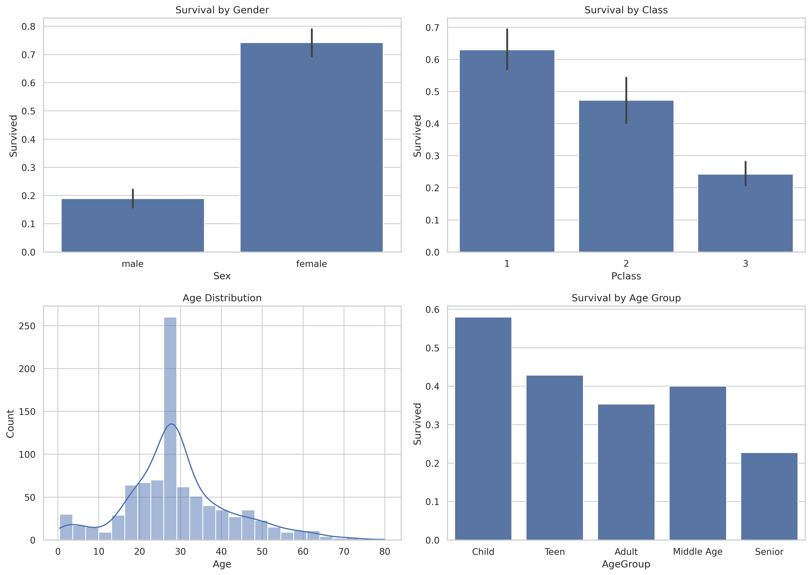
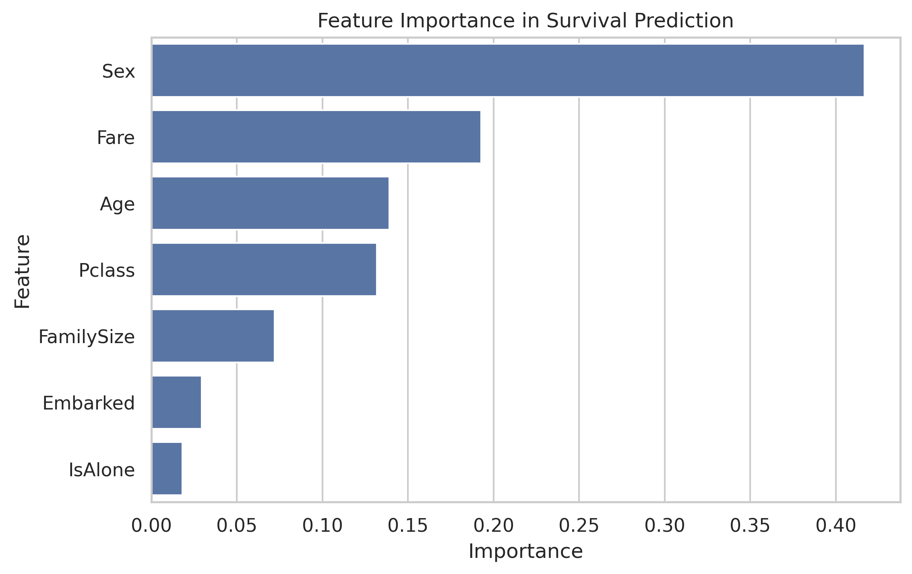
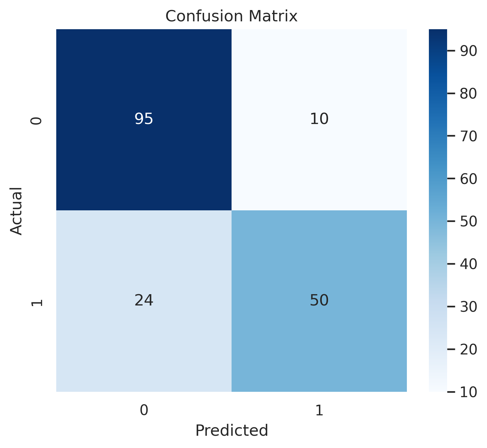

# Titanic Survival Analytics and Explainable Machine Learning Prediction System

This project analyzes the famous Titanic dataset using Data Science, Machine Learning, and Explainable AI techniques.

The project demonstrates the complete Data Science workflow:

- Data Cleaning
- Exploratory Data Analysis (EDA)
- Data Visualization
- Feature Engineering
- Machine Learning Prediction
- Explainable AI (SHAP)

Dataset

Source: Kaggle Titanic Dataset

The dataset contains passenger information such as:

- Passenger Class (Pclass)
- Gender (Sex)
- Age
- Fare
- Family Size
- Embarkation Port

Target Variable:

- Survived (0 = No, 1 = Yes)

## Technologies Used

- Python
- Pandas
- NumPy
- Matplotlib
- Seaborn
- Scikit-Learn
- SHAP
- Google Colab

## Machine Learning Model

### Random Forest Classifier

Model Accuracy:

**81.01%**

The model was trained using passenger demographic and travel-related features to predict survival outcomes.

## Project Dashboard

The dashboard summarizes key survival trends across gender, passenger class, age distribution, and age groups.

## Feature Importance Analysis

Random Forest Feature Importance identified the most influential factors affecting passenger survival.

### Top Influential Features

1. Sex
2. Fare
3. Age
4. Passenger Class
5. Family Size

Key observation:

- Gender was the strongest predictor of survival.
- Female passengers had significantly higher survival rates.
- Higher-class passengers had better survival chances.

## Confusion Matrix

The confusion matrix evaluates model prediction performance on unseen test data.

## Key Findings

### Gender Impact

- Female passengers had approximately 74% survival rate.
- Male passengers had approximately 19% survival rate.

### Passenger Class Impact

- First-class passengers had the highest survival probability.
- Third-class passengers had the lowest survival probability.

### Age Impact

- Children had the highest survival rates.
- Senior passengers had the lowest survival rates.

### Fare Impact

- Passengers paying higher fares generally had better survival chances.

## Explainable AI (SHAP)

SHAP (SHapley Additive exPlanations) was used to interpret the machine learning model.

SHAP analysis confirmed that:

- Sex
- Fare
- Age
- Passenger Class

were the most influential factors affecting survival predictions.

## Project Workflow

1. Data Collection
2. Data Cleaning
3. Missing Value Treatment
4. Exploratory Data Analysis
5. Feature Engineering
6. Data Visualization
7. Machine Learning Model Development
8. Model Evaluation
9. Explainable AI Analysis
10. Result Interpretation

## Future Improvements

- Hyperparameter Optimization using GridSearchCV
- XGBoost and LightGBM Models
- Interactive Streamlit Dashboard
- Web Deployment
- Advanced Explainable AI Techniques

